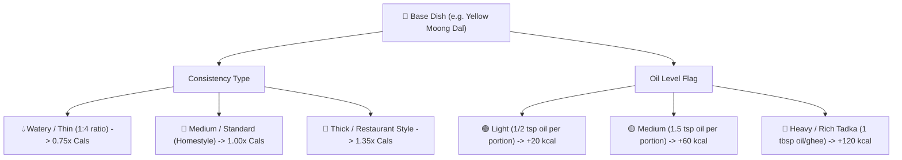

# 🥗 Indian Food & Ingredient Nutritional Master Dataset

> [!NOTE]
> All primary nutritional values are standardized **per 100g base weight** for exact calculation and scaling. Common Indian serving units (e.g. 1 medium roti, 1 katori, 1 piece, 1 scoop) are mapped with default gram weights.

---

## 📋 Categorized Food Tracking Tables

### 1. 🫓 Rotis, Breads & Flatbreads (`category: 'rotis'`)

| ID | Item Name | Default Serving | Calories (100g) | Protein (g) | Carbs (g) | Fats (g) | Fiber (g) | Notes / Variants |
| :--- | :--- | :--- | :--- | :--- | :--- | :--- | :--- | :--- |
| `roti_wheat_plain` | **Wheat Roti / Chapati (No Ghee)** | 1 roti (35g) | 242 | 8.5 | 50.0 | 1.5 | 7.0 | Whole wheat flour, dry tawa |
| `roti_wheat_ghee` | **Wheat Roti with Ghee (1/2 tsp)** | 1 roti (40g) | 335 | 7.8 | 44.0 | 13.5 | 6.2 | Standard homestyle with ghee |
| `roti_jowar` | **Jowar Bhakri / Roti** | 1 bhakri (50g) | 240 | 7.2 | 52.0 | 1.4 | 8.2 | Gluten-free sorghum millet |
| `roti_bajra` | **Bajra Roti** | 1 roti (50g) | 258 | 8.0 | 54.0 | 2.5 | 9.0 | Pearl millet, winter staple |
| `roti_ragi` | **Ragi Roti / Nachni** | 1 roti (50g) | 228 | 5.5 | 48.0 | 1.2 | 8.5 | Finger millet, calcium rich |
| `roti_makki` | **Makki Ki Roti** | 1 roti (50g) | 270 | 6.8 | 55.0 | 3.0 | 7.5 | Corn flour flatbread |
| `roti_paratha_plain` | **Plain Tawa Paratha** | 1 paratha (60g) | 330 | 7.0 | 48.0 | 12.0 | 5.5 | Layered with oil/ghee on tawa |
| `roti_paratha_aloo` | **Aloo Paratha** | 1 paratha (100g) | 260 | 5.2 | 38.0 | 9.5 | 3.8 | Potato filling with spices |
| `roti_paratha_paneer`| **Paneer Paratha** | 1 paratha (100g) | 290 | 10.5 | 34.0 | 12.5 | 3.2 | High protein stuffed paratha |
| `roti_naan_plain` | **Tandoori Roti / Naan (Plain)**| 1 naan (75g) | 295 | 8.5 | 56.0 | 3.5 | 3.0 | Refined/whole wheat tandoor baked |

---

### 2. 🌰 Nuts & Seeds (`category: 'nuts_seeds'`)

| ID | Item Name | Default Serving | Calories (100g) | Protein (g) | Carbs (g) | Fats (g) | Fiber (g) | Key Health Benefit |
| :--- | :--- | :--- | :--- | :--- | :--- | :--- | :--- | :--- |
| `seed_chia` | **Chia Seeds** | 1 tbsp (15g) | 486 | 16.5 | 42.1 | 30.7 | 34.4 | Soluble fiber & Omega-3 |
| `seed_flax` | **Flax Seeds (Alsi)** | 1 tbsp (15g) | 534 | 18.3 | 28.9 | 42.2 | 27.3 | Lignans & ALA |
| `seed_pumpkin` | **Pumpkin Seeds (Kaddu)** | Handful (20g) | 559 | 30.2 | 10.7 | 49.0 | 6.0 | Zinc & Magnesium |
| `seed_sunflower` | **Sunflower Seeds** | Handful (20g) | 584 | 20.8 | 20.0 | 51.5 | 8.6 | Vitamin E |
| `seed_sesame_white` | **White Sesame Seeds (Til)** | 1 tbsp (15g) | 573 | 17.7 | 23.4 | 49.7 | 11.8 | High calcium |
| `seed_sesame_black` | **Black Sesame Seeds** | 1 tbsp (15g) | 575 | 18.0 | 23.0 | 50.0 | 12.0 | Antioxidants |
| `seed_watermelon` | **Watermelon Seeds (Magaz)** | 1 tbsp (15g) | 557 | 28.3 | 15.3 | 47.4 | 5.5 | Iron & Folate |
| `seed_muskmelon` | **Muskmelon Seeds (Kharbuja)** | 1 tbsp (15g) | 550 | 26.0 | 16.0 | 46.0 | 6.0 | Plant protein |
| `seed_hemp` | **Hemp Hearts / Seeds** | 1 tbsp (15g) | 553 | 31.6 | 8.7 | 48.8 | 4.0 | Complete plant protein |
| `seed_sabja` | **Sabja / Basil Seeds** | 1 tbsp (15g) | 440 | 14.8 | 45.0 | 25.0 | 38.0 | Cooling & digestion |
| `nut_almond` | **Almonds (Badam)** | Handful (25g) | 579 | 21.2 | 21.6 | 49.9 | 12.5 | Vitamin E & healthy fats |
| `nut_walnut` | **Walnuts (Akhrot)** | Handful (25g) | 654 | 15.2 | 13.7 | 65.2 | 6.7 | Brain health / DHA |
| `nut_cashew` | **Cashews (Kaju)** | Handful (25g) | 553 | 18.2 | 30.2 | 43.8 | 3.3 | Copper & Magnesium |
| `nut_pistachio` | **Pistachios (Pista)** | Handful (25g) | 560 | 20.2 | 27.2 | 45.3 | 10.6 | Eye health & B6 |
| `nut_peanuts` | **Peanuts (Mungfali, Roasted)** | Handful (30g) | 567 | 25.8 | 16.1 | 49.2 | 8.5 | Budget daily protein |
| `nut_peanut_butter`| **Peanut Butter (100% Unsweetened)** | 1 tbsp (20g) | 588 | 25.0 | 20.0 | 50.0 | 6.0 | Clean spreads |

---

### 3. 🥛 Milk & Dairy Products (`category: 'dairy'`)

| ID | Item Name | Default Serving | Calories (100g) | Protein (g) | Carbs (g) | Fats (g) | Fiber (g) | Primary Source |
| :--- | :--- | :--- | :--- | :--- | :--- | :--- | :--- | :--- |
| `dairy_cow_milk` | **Cow Milk (Standard 3.5% fat)** | 1 glass (250ml) | 62 | 3.2 | 4.8 | 3.3 | 0 | Fresh dairy |
| `dairy_buffalo_milk` | **Buffalo Milk (6.5% fat)** | 1 glass (250ml) | 97 | 3.8 | 5.2 | 6.5 | 0 | Rich traditional milk |
| `dairy_toned_milk` | **Toned Milk (3% fat)** | 1 glass (250ml) | 58 | 3.1 | 4.7 | 3.0 | 0 | Packaged toned |
| `dairy_double_toned`| **Double Toned Milk (1.5% fat)** | 1 glass (250ml) | 48 | 3.3 | 4.8 | 1.5 | 0 | Low fat |
| `dairy_curd_dahi` | **Curd / Dahi (Whole Milk)** | 1 katori (150g) | 61 | 3.5 | 4.7 | 3.3 | 0 | Probiotic fermented |
| `dairy_curd_skimmed`| **Low Fat Dahi** | 1 katori (150g) | 45 | 4.2 | 5.0 | 1.0 | 0 | Low fat dahi |
| `dairy_chaas` | **Chaas / Buttermilk (Salted)** | 1 glass (250ml) | 28 | 1.6 | 2.5 | 1.2 | 0 | Refreshing digestive drink |
| `dairy_paneer` | **Fresh Paneer (Full Fat)** | 100g block | 265 | 18.3 | 1.2 | 20.8 | 0 | Core vegetarian protein |
| `dairy_paneer_lowfat`| **Low Fat Paneer** | 100g block | 140 | 24.0 | 2.0 | 4.0 | 0 | Gym/diet special |
| `dairy_tofu` | **Firm Tofu (Soy Paneer)** | 100g block | 76 | 8.1 | 1.9 | 4.8 | 0.9 | Plant-based vegan |
| `dairy_ghee` | **Desi Cow Ghee** | 1 tsp (5g) | 900 | 0 | 0 | 100.0 | 0 | Pure clarified butter |
| `dairy_butter` | **Table Butter (Amul/Home)** | 1 pat (10g) | 717 | 0.9 | 0.1 | 81.1 | 0 | Salted/unsalted |
| `dairy_cheese_slice`| **Processed Cheese Slice** | 1 slice (20g) | 320 | 18.0 | 3.0 | 26.0 | 0 | Breakfast sandwich |
| `dairy_whey_isolate`| **Whey Protein (80%)** | 1 scoop (30g) | 400 | 80.0 | 6.7 | 5.0 | 1.0 | Post-workout scoop |

---

### 4. 🍗 Meats, Poultry, Fish & Eggs (`category: 'meat'`)

| ID | Item Name | Default Serving | Calories (100g) | Protein (g) | Carbs (g) | Fats (g) | Fiber (g) | Preparation Notes |
| :--- | :--- | :--- | :--- | :--- | :--- | :--- | :--- | :--- |
| `egg_whole_boiled` | **Whole Egg (Boiled)** | 1 egg (50g) | 143 | 12.6 | 0.7 | 9.5 | 0 | Hard boiled |
| `egg_white_boiled` | **Egg White (Boiled)** | 1 white (33g) | 52 | 10.9 | 0.7 | 0.2 | 0 | Pure lean protein |
| `egg_omelette_2` | **2-Egg Omelette (with 1 tsp oil)** | 1 plate (110g) | 175 | 12.0 | 1.2 | 13.8 | 0 | Cooked with onions/chili |
| `egg_bhurji` | **Egg Bhurji (2 Eggs)** | 1 katori (130g) | 165 | 11.5 | 2.5 | 12.0 | 0.5 | Scrambled with Indian spices |
| `chicken_breast_raw`| **Chicken Breast (Raw)** | 1 breast (150g)| 120 | 22.5 | 0 | 2.6 | 0 | Skinless & boneless |
| `chicken_breast_cooked`| **Chicken Breast (Boiled/Grilled)**| 120g portion | 165 | 31.0 | 0 | 3.6 | 0 | Zero oil / minimal oil |
| `chicken_thigh_cooked`| **Chicken Thigh (Skinless, Cooked)**| 120g portion | 209 | 26.0 | 0 | 10.9 | 0 | Juicy dark meat |
| `chicken_curry_homestyle`| **Homestyle Chicken Curry** | 1 katori (180g)| 155 | 18.0 | 3.5 | 7.8 | 0.8 | Onion-tomato gravy |
| `fish_rohu` | **Rohu / Katla (Freshwater Fish)** | 1 fillet (120g)| 102 | 17.5 | 0 | 3.2 | 0 | Bengali/Indian staple fish |
| `fish_salmon` | **Atlantic Salmon (Cooked)** | 1 fillet (130g)| 206 | 22.1 | 0 | 12.3 | 0 | Rich Omega-3 fish |
| `meat_mutton_curry` | **Mutton Curry (Homestyle)** | 1 katori (180g)| 220 | 19.5 | 4.0 | 14.0 | 0.6 | Goat meat curry |
| `meat_prawns` | **Prawns / Shrimp (Cooked)** | 100g portion | 99 | 24.0 | 0.2 | 0.3 | 0 | Lean seafood protein |

---

### 5. 🍎 Fruits & Berries (`category: 'fruits'`)

| ID | Item Name | Default Serving | Calories (100g) | Protein (g) | Carbs (g) | Fats (g) | Fiber (g) | Season / Characteristic |
| :--- | :--- | :--- | :--- | :--- | :--- | :--- | :--- | :--- |
| `fruit_banana` | **Banana (Kela)** | 1 medium (120g)| 89 | 1.1 | 22.8 | 0.3 | 2.6 | Pre-workout fast carbs |
| `fruit_apple` | **Apple (Seb)** | 1 medium (140g)| 52 | 0.3 | 13.8 | 0.2 | 2.4 | Pectin rich daily fruit |
| `fruit_papaya` | **Papaya (Papita)** | 1 cup (140g) | 43 | 0.5 | 10.8 | 0.3 | 1.7 | Digestive enzymes |
| `fruit_guava` | **Guava (Amrood)** | 1 medium (100g)| 68 | 2.6 | 14.3 | 1.0 | 5.4 | Ultra high vitamin C & fiber |
| `fruit_pomegranate`| **Pomegranate (Anaar)** | 1 cup (150g) | 83 | 1.7 | 18.7 | 1.2 | 4.0 | Iron & Polyphenols |
| `fruit_mango` | **Mango (Aam)** | 1 cup diced (150g)| 60 | 0.8 | 15.0 | 0.4 | 1.6 | Summer favourite |
| `fruit_watermelon` | **Watermelon (Tarbooj)** | 1 bowl (200g) | 30 | 0.6 | 7.6 | 0.2 | 0.4 | Hydrating low calorie |
| `fruit_muskmelon` | **Muskmelon (Kharbuja)** | 1 bowl (180g) | 34 | 0.8 | 8.2 | 0.2 | 0.9 | Low calorie summer fruit |
| `fruit_orange` | **Orange / Mosambi** | 1 medium (130g)| 47 | 0.9 | 11.8 | 0.1 | 2.4 | Citrus vitamin C |
| `fruit_grapes` | **Green / Black Grapes** | 1 cup (100g) | 69 | 0.7 | 18.1 | 0.2 | 0.9 | Natural sugars & energy |
| `fruit_blueberries`| **Blueberries** | 1 cup (100g) | 57 | 0.7 | 14.5 | 0.3 | 2.4 | Brain superfood |
| `fruit_strawberries`| **Strawberries** | 1 cup (100g) | 32 | 0.7 | 7.7 | 0.3 | 2.0 | Low GI antioxidant berry |
| `fruit_dates` | **Dates (Khajoor)** | 2 pieces (20g) | 277 | 1.8 | 75.0 | 0.2 | 6.7 | Natural pre-workout sweetener |
| `fruit_amla` | **Indian Gooseberry (Amla)** | 1 piece (30g) | 44 | 0.9 | 10.2 | 0.6 | 4.3 | Immunity booster |

---

### 6. 🥣 Breakfast & Snack Staples (`category: 'grains'`)

| ID | Item Name | Default Serving | Calories (100g) | Protein (g) | Carbs (g) | Fats (g) | Fiber (g) | Description |
| :--- | :--- | :--- | :--- | :--- | :--- | :--- | :--- | :--- |
| `bf_poha_cooked` | **Kanda Poha (Cooked with Peanuts)**| 1 plate (160g) | 165 | 3.5 | 28.0 | 4.5 | 2.2 | Flattened rice with tempering |
| `bf_idli` | **Steamed Rice Idli** | 2 pieces (100g)| 132 | 3.9 | 27.5 | 0.4 | 1.8 | Fermented rice & urad dal |
| `bf_dosa_plain` | **Plain Dosa (Thin/Crispy)** | 1 dosa (80g) | 168 | 4.2 | 29.0 | 3.8 | 1.5 | Fermented crepe on tawa |
| `bf_upma` | **Rava / Suji Upma** | 1 katori (150g) | 145 | 3.8 | 24.0 | 4.0 | 1.8 | Semolina savory porridge |
| `bf_besan_chilla` | **Besan Chilla (Gram Flour)** | 1 chilla (70g) | 175 | 7.5 | 22.0 | 6.0 | 3.5 | High protein savory pancake |
| `bf_moong_chilla` | **Moong Dal Chilla** | 1 chilla (70g) | 160 | 8.8 | 21.0 | 4.2 | 4.0 | Yellow/green moong crepe |
| `bf_oats_cooked` | **Oats Porridge (in Water/Milk)**| 1 bowl (200g) | 75 | 3.2 | 13.0 | 1.5 | 2.0 | Rolled oats breakfast |

---

## 🍲 Cooking Consistency & Oil Level Flags Schema (For Dals, Sabjis & Curries)

### Supported Dynamic Modifiers:
- **`consistency` Options**:
  - `watery`: Higher water content, lighter calorie density.
  - `medium`: Standard everyday homestyle consistency.
  - `thick`: Dense dal or dry sabzi preparation.
- **`oilLevel` Options**:
  - `light`: Minimal cooking spray / diet homestyle.
  - `medium`: Standard family cooking.
  - `heavy`: Restaurant / Dhaba style rich tadka.
